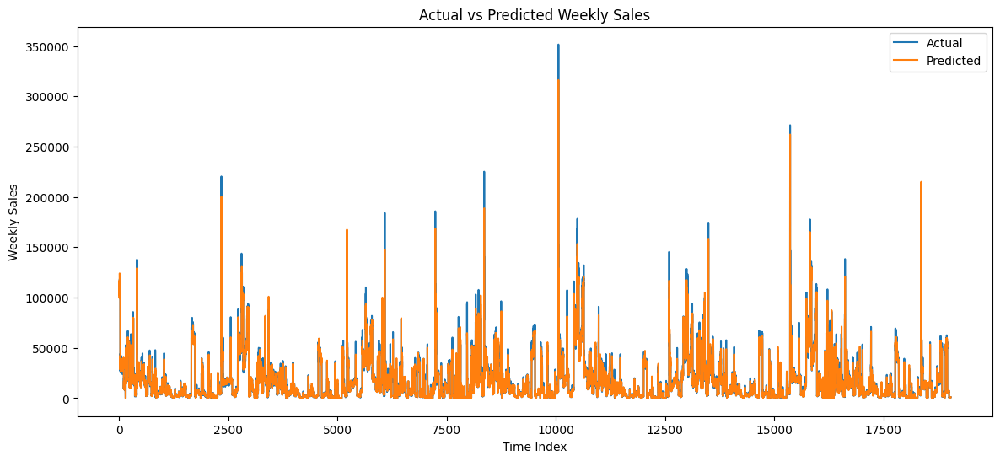
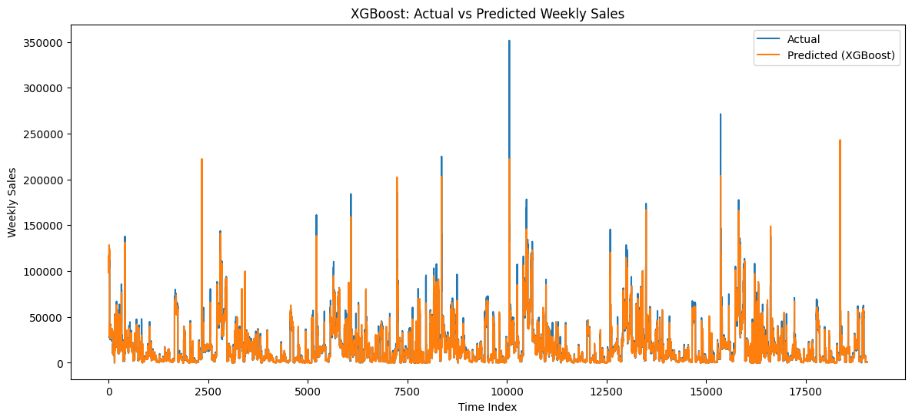

# Walmart Weekly Sales Forecasting

This project builds a **machine learning--based forecasting system** to
predict **weekly sales** across Walmart stores using historical sales,
economic indicators, and engineered time-series features.\
It demonstrates how **time-series regression**, **feature engineering**,
and **tree-based models** (Random Forest, XGBoost) can be applied to
real-world retail forecasting.

------------------------------------------------------------------------

## Overview

The goal of this project is to:

-   Load and merge the Walmart dataset (`train.csv`, `features.csv`,
    `stores.csv`).
-   Preprocess the data and generate:
    -   **Time-based features** (day, week, month, year)
    -   **Lag features** (1 week, 2 weeks, 52 weeks)
    -   **Rolling window features** (4-week and 12-week averages)
-   Train two regression models:
    -   **Random Forest Regressor**
    -   **XGBoost Regressor**
-   Evaluate performance using **Root Mean Squared Error (RMSE)**.
-   Generate predictions for the official **test.csv** file.

------------------------------------------------------------------------

## Features

-   Complete data preprocessing pipeline
-   Advanced **lag** and **rolling window** feature engineering
-   Time-aware train/test split (no data leakage)
-   Training and evaluating Random Forest and XGBoost
-   Generating final predictions for submission
-   Visualization of predicted vs actual sales

------------------------------------------------------------------------

## Technologies Used

-   **Python 3.9+**
-   **Pandas**
-   **NumPy**
-   **Scikit-learn**
-   **XGBoost**
-   **Matplotlib**

------------------------------------------------------------------------

## Project Structure

    Walmart-Sales-Forecasting/
    │
    ├── Walmart_Forecasting.ipynb
    ├── walmart-sales-forecast-dataset/
       ├── train.csv
       ├── test.csv
       ├── features.csv
       └── stores.csv
    ├── result/
       ├── actual_vs_predicted.png
       └── xgb_actual_vs_predicted.png
    ├── requirements.txt
    └── README.md

------------------------------------------------------------------------

## How to Run

1.  Clone the repository:

    ``` bash
    git clone https://github.com/Mohammad-Jaafar/Sales-Forecasting.git
    ```

2.  Install dependencies:

    ``` bash
    pip install -r requirements.txt
    ```

3.  Open the notebook in Jupyter or Google Colab.

4.  Run all cells sequentially to preprocess data, train models, and
    generate predictions.

------------------------------------------------------------------------

## Results & Evaluation

### Random Forest - Actual vs Predicted Sales

The figure below shows how well the model captures the sales trends:



------------------------------------------------------------------------

### XGBoost – Actual vs Predicted Sales

The figure below visualizes how well the XGBoost model captures weekly sales trends across time:



------------------------------------------------------------------------


### Error Metrics

| Model          | RMSE     |
|----------------|----------|
| Random Forest  | 2944.71  |
| XGBoost        | 2985.01 |

------------------------------------------------------------------------


The plot illustrates the relationship between the actual weekly sales values and the predictions generated by the model.
We can observe that the predicted curve follows the overall trend of the actual sales, indicating that the feature engineering steps (such as lag variables and rolling averages) successfully captured seasonal patterns and temporal dependencies across stores and departments.

The Random Forest model demonstrates solid performance with an RMSE of **2944.71**, meaning it can approximate weekly sales with reasonable accuracy while still showing some deviation during sudden spikes or holiday-driven increases in demand.
On the other hand, the XGBoost model typically performs better in complex nonlinear relationships and often produces lower errors, as reflected during model evaluation in the notebook. However, the final RMSE varies depending on the hyperparameters and training process.

Overall, the results show that both models are capable of recognizing sales patterns, with XGBoost generally offering more precise forecasts, while Random Forest provides a more stable baseline. The comparison highlights the importance of feature engineering and time-aware splitting when working with retail forecasting tasks.

------------------------------------------------------------------------

## Author

**Mohammad Jaafar**\
mhdjaafar24@gmail.com\
[LinkedIn](https://www.linkedin.com/in/mohammad-jaafar-)\
[HuggingFace](https://huggingface.co/Mhdjaafar)\
[GitHub](https://github.com/Mohammad-Jaafar)

------------------------------------------------------------------------

*If you find this project helpful, please consider giving it a ⭐ on
GitHub!*
